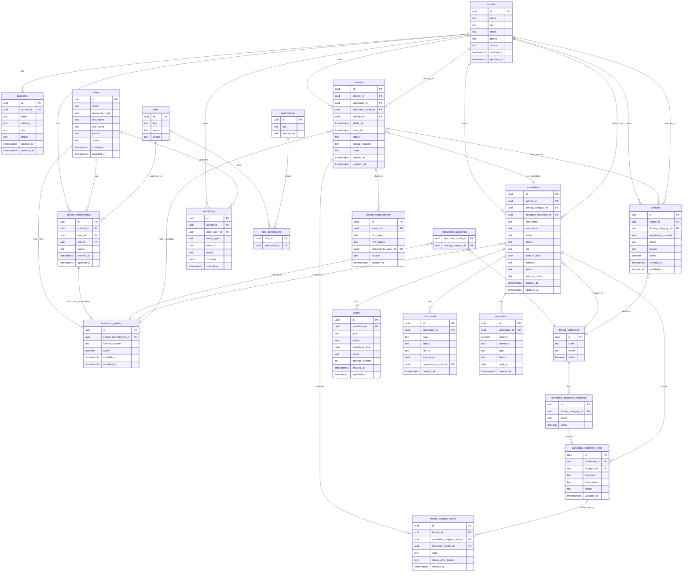

# Auto Skola 365 - Initial ERD

Status: Draft  
Created: 2026-09-04

## Implementation Status

Implemented in Flyway `V2__identity_foundation.sql`:

- schools
- branches
- users
- roles
- permissions
- role_permissions
- school_memberships
- driving_categories

## Scope

This ERD covers the MVP domain model for:

- Schools, branches and memberships.
- Users, roles and permissions.
- Candidates and instructors.
- Lessons, scheduling and progress tracking.
- Model-aware placeholders for exams, documents, payments and audit logs.

## Mermaid ERD

## Important Modeling Notes

- Every operational record must be school-scoped directly or through an owned
  parent entity.
- Scheduling conflict checks belong in the backend service layer and should be
  backed by database indexes where possible.
- Candidate progress templates should be configurable per driving category.
- Exams, documents and payments are included as model-aware entities, but full
  UI implementation is outside the first admin-core MVP.
- Audit logs should be append-only and should not depend on UI behavior.

## First Implementation Order

1. `schools`, `branches`, `users`, `roles`, `permissions`,
   `school_memberships`.
2. `driving_categories`, `instructor_profiles`, `candidates`.
3. `vehicles`, `lessons`, `lesson_status_history`.
4. `candidate_progress_templates`, `candidate_progress_items`,
   `lesson_progress_notes`.
5. Model-aware placeholders for `exams`, `documents`, `payments`, `audit_logs`.
